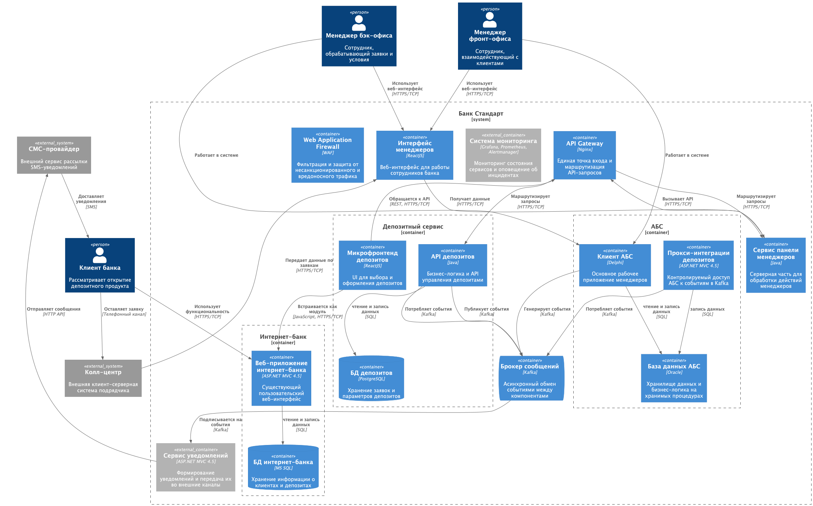
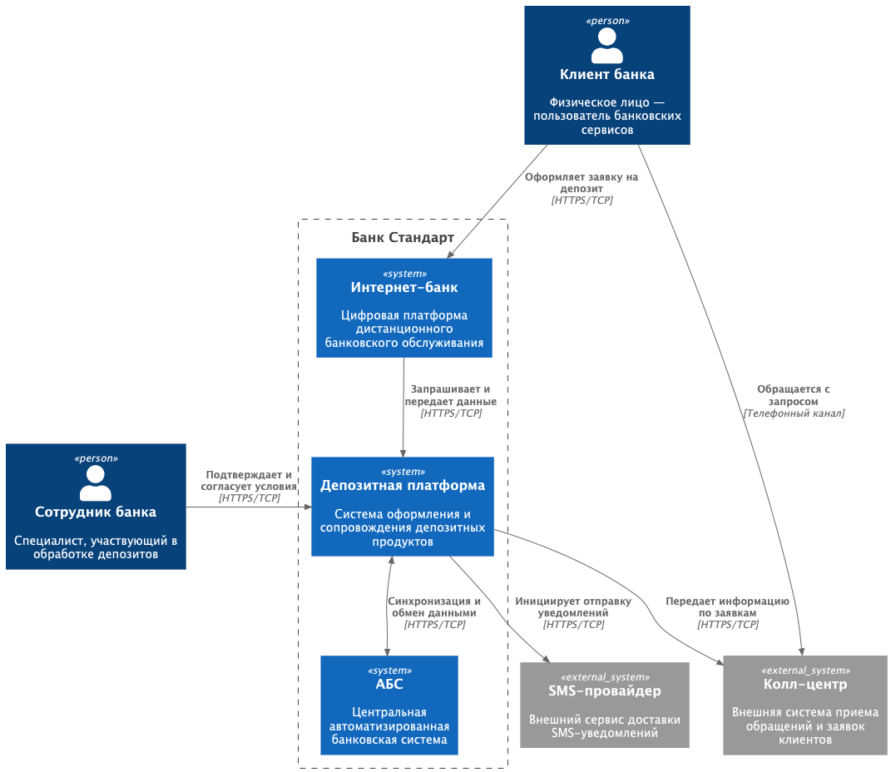

### **Название задачи: Открытие депозитов онлайн**

### **Автор: Шувалов Д.Н.**

### **Дата: 03 января 2026**

### **Функциональные требования**

Ниже приведены верхнеуровневые пользовательские сценарии (Use Cases), описывающие ключевые взаимодействия в рамках MVP. Сценарии оформлены в табличном виде с пошаговым описанием:

| **№** | **Действующие лица или системы**                              | **Use Case**                                                                     | **Описание**                                                                                                                              |
| :----: | :------------------------------------------------------------------------------------- | :------------------------------------------------------------------------------- | :------------------------------------------------------------------------------------------------------------------------------------------------ |
|  UC1  | Пользователь, веб-сайт                                              | Ознакомление с депозитными продуктами          | 1. Пользователь открывает веб-сайт банка                                                                         |
|        |                                                                                        |                                                                                  | 2. Пользователь изучает перечень доступных вкладов и актуальные ставки                |
|        |                                                                                        |                                                                                  | 3. Пользователь инициирует подачу заявки на открытие депозита                                 |
|  UC2  | Пользователь, веб-сайт, колл-центр                         | Создание заявки на депозит                                | 1. Пользователь вводит ФИО в форму заявки                                                                        |
|        |                                                                                        |                                                                                  | 2. Пользователь указывает номер телефона                                                                        |
|        |                                                                                        |                                                                                  | 3. Пользователь отправляет заявку                                                                                     |
|        |                                                                                        |                                                                                  | 4. Персональные данные шифруются и передаются в систему обработки                          |
|        |                                                                                        |                                                                                  | 5. Пользователь подтверждает заявку с помощью кода из SMS                                             |
|  UC3  | Пользователь, интернет-банк, депозиты                  | Просмотр оформленных депозитов                       | 1. Пользователь авторизуется в интернет-банке                                                               |
|        |                                                                                        |                                                                                  | 2. Пользователь просматривает список своих депозитов                                                 |
|        |                                                                                        |                                                                                  | 3. Пользователь открывает детальную информацию по выбранному депозиту                 |
|  UC4  | Пользователь, бэк-офис, интернет-банк, депозиты | Получение персональных условий по депозиту | 1. Сотрудники бэк-офиса формируют индивидуальные ставки                                            |
|        |                                                                                        |                                                                                  | 2. Персональные условия сохраняются в системе депозитов                                            |
|        |                                                                                        |                                                                                  | 3. Пользователь видит персональные предложения в интернет-банке                             |
|  UC5  | SMS-шлюз, АБС, бэк-офис                                                  | Получение SMS-уведомлений                                    | 1. Бэк-офис подтверждает условия депозита в АБС                                                             |
|        |                                                                                        |                                                                                  | 2. Информация передается в систему отправки SMS                                                               |
|        |                                                                                        |                                                                                  | 3. Клиент получает уведомление о ставке и факте открытия депозита                           |
|  UC6  | Колл-центр, депозиты                                                  | Обработка заявок клиентов                                 | 1. Колл-центр принимает заявку на депозит                                                                        |
|        |                                                                                        |                                                                                  | 2. Для сотрудника бэк-офиса формируется задача на обработку                                      |
|        |                                                                                        |                                                                                  | 3. Сотрудник рассчитывает условия и инициирует открытие депозита                           |
|  UC7  | Фронт-офис, АБС                                                            | Идентификация клиента                                        | 1. Сотрудник фронт-офиса подтверждает личность клиента                                              |
|        |                                                                                        |                                                                                  | 2. Клиенту предоставляется доступ к интернет-банку                                                      |
|        |                                                                                        |                                                                                  | 3. Пользователь получает возможность оформления депозитов                                       |
|  UC8  | Бэк-офис, депозиты                                                      | Управление процентными ставками                     | 1. Сотрудник бэк-офиса входит в административный интерфейс депозитного сервиса |
|        |                                                                                        |                                                                                  | 2. Просматривает список клиентов и назначенные им ставки                                           |
|        |                                                                                        |                                                                                  | 3. Вносит изменения в персональные условия при необходимости                                   |

### **Нефункциональные требования**

В данном разделе перечислены ключевые нефункциональные и архитектурно значимые требования:

| **№** | **Требование**                                                                                               |
| :----: | :--------------------------------------------------------------------------------------------------------------------- |
|   1   | Доступность системы не ниже 99.9%                                                              |
|   2   | Возможность горизонтального масштабирования сервисов                  |
|   3   | Среднее время отклика пользовательских операций — не более 500 мс |
|   4   | Устойчивость к отказам, дублирование критичных компонентов         |
|   5   | Использование микросервисного архитектурного подхода                  |
|   6   | Обеспечение совместимости с легаси-системами                                   |
|   7   | Применение существующего технологического стека                            |

### **Решение**

[containers.puml](containers.puml)
[context.puml](context.puml)

1. Все новые компоненты реализуются в виде микросервисов, что упрощает масштабирование, сопровождение и дальнейшее развитие платформы.
2. Для реализации депозитного сервиса выбраны Java и PostgreSQL, поскольку команда уже обладает экспертизой в смежных технологиях (C#, Oracle), а стоимость адаптации минимальна.
3. Разработка депозитного сервиса выполняется внутренней командой без привлечения внешних подрядчиков.
4. Выделен отдельный сервис уведомлений, так как АБС перегружена; новая система позволяет гибко добавлять каналы коммуникаций в будущем.
5. Реализована отдельная система «Панель менеджеров» для сотрудников фронт- и бэк-офиса с целью отказа от Excel и email-цепочек, повышения прозрачности процессов и ускорения обработки заявок.

### **Альтернативы**

1. Для ускорения выпуска MVP возможно отказаться от панели менеджеров и временно использовать существующие инструменты (например, Excel).
2. В рамках MVP можно не внедрять отдельный сервис уведомлений, а доработать текущие механизмы АБС.

### **Недостатки, ограничения, риски**

1. Потребуется расширение команды разработки в связи с ростом количества сервисов.
2. Усложняется бизнес-процесс, возрастает потребность в обучении пользователей и подготовке методических материалов.
3. Архитектура и инфраструктура системы становятся более комплексными.
4. Возникает необходимость в специалистах SRE для автоматизации и сопровождения инфраструктуры.
5. Требуется разработка и поддержка end-to-end тестирования из-за большого числа интеграций.
6. Необходима реализация централизованного мониторинга, логирования и трассировки.
