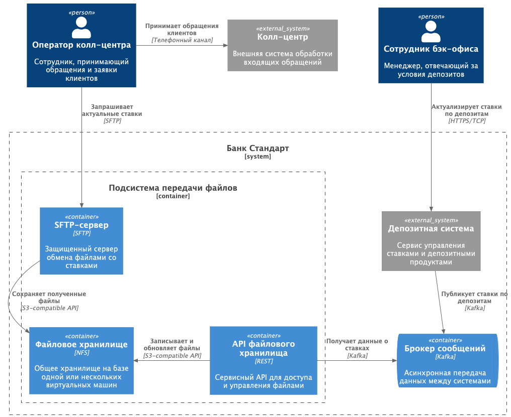
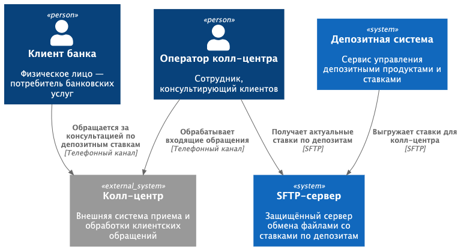

### **Название задачи: Передача ставок в кол-центр**

### **Автор: Шувалов Д.Н.**

### **Дата: 03 января 2026**

### **Функциональные требования**

| **№** | **Действующие лица или системы**                                           | **Use Case**                                                                               | **Описание**                                                                                                         |
| :----: | :-------------------------------------------------------------------------------------------------- | :----------------------------------------------------------------------------------------- | :--------------------------------------------------------------------------------------------------------------------------- |
|        | пользователь, менеджер колл-центра, система депозитов | Пользователь обращается за актуальными ставками | 1. Пользователь обращается в колл-центр для получения свежих ставок |
|        |                                                                                                     |                                                                                            | 2. Менеджер запрашивает последние ставки в системе депозитов                                   |
|        |                                                                                                     |                                                                                            | 3. Менеджер считывает файл с актуальной информацией по ставкам                                         |
|        |                                                                                                     |                                                                                            | 4. Колл-центр должен иметь возможность получать самые актуальные ставки при обращении клиента                         |

### **Нефункциональные требования**

| **№** | **Требование**                                                                                                                  |
| :----: | :---------------------------------------------------------------------------------------------------------------------------------------- |
|   1   | Обмен информацией между системами возможен только через файлы                                                           |
|   2   | Передача файлов должна выполняться исключительно по защищённым каналам связи                                     |
|   3   | Колл-центр должен иметь возможность получать самые актуальные ставки при обращении клиента |

### **Решение**

1. Файлы передаются по протоколу SFTP, что обеспечивает надёжность и защищённость данных.
2. Колл-центр получает доступ к актуальным ставкам в момент обращения клиента, повышая качество обслуживания.
3. Данные о ставках обновляются в файлах на файловом сервере и передаются через очередь сообщений, что обеспечивает устойчивость к сбоям и надежность процесса.
4. Сервис интеграции депозитов формирует файлы и актуализирует данные, а колл-центр использует эти файлы для обслуживания пользователей.

[containers.puml](containers.puml)
[context.puml](context.puml)

### **Альтернативы**

1. Вместо файлового хранилища с доступом по SFTP можно использовать Email для передачи ставок.
2. Можно создать дашборд с отображением даты, времени и ставок через HTTPS с персональными учетными записями:
   2.1 Дашборд может считывать данные из ранее сформированных файлов.
   2.2 Дашборд может получать информацию напрямую из базы данных, без использования файлов.

**Недостатки, ограничения, риски**

1. Для работы с SFTP сотруднику колл-центра требуется корректная настройка подключения, возможны индивидуальные сложности.
2. Может потребоваться корректировка политик Windows или правил фаервола для доступа к SFTP и новому адресу.
3. Увеличение объема файлов и количества пользователей может создать дополнительную нагрузку на инфраструктуру.